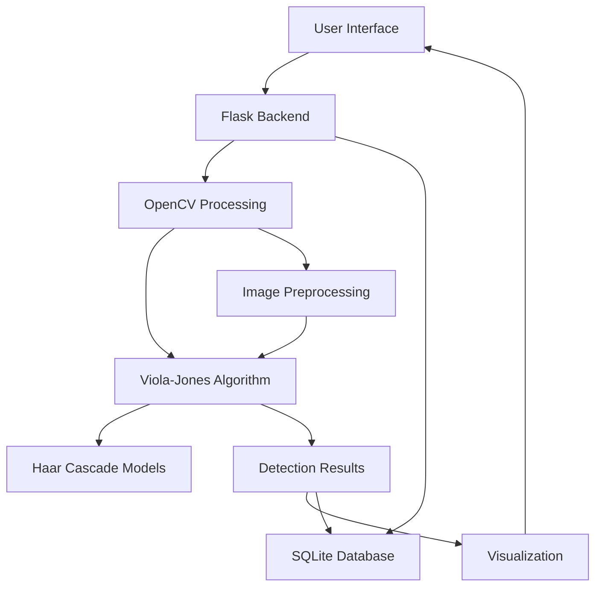
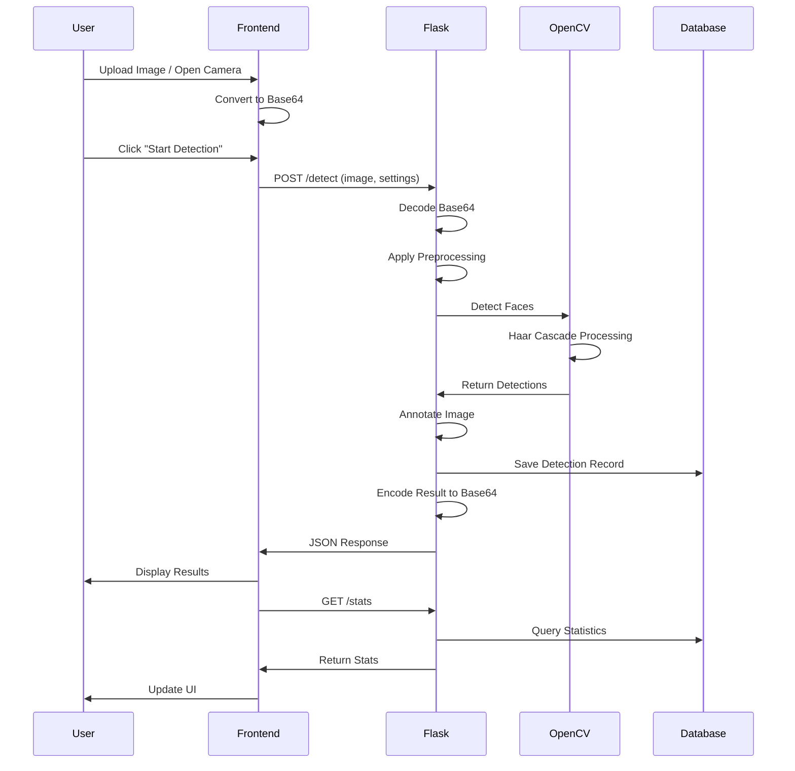

# 📋 Project Outline - Face Detection System

## 🎯 Project Overview

**Project Name**: Face Detection - Viola Jones Algorithm  
**Type**: Web Application  
**Purpose**: Advanced face detection system with multi-face recognition, eye detection, and smile detection capabilities  
**Status**: Production Ready

---

## 🏗️ System Architecture



---

## 📁 Project Structure

```
face-detection-viola-jones/
│
├── 📄 app.py                      # Main Flask application (335 lines)
│   ├── Flask routes & API endpoints
│   ├── Image preprocessing functions
│   ├── Face detection logic
│   └── Database operations
│
├── 📁 templates/
│   └── 📄 index.html              # Frontend UI (838 lines)
│       ├── Modern dark theme CSS
│       ├── Responsive layout
│       └── JavaScript detection logic
│
├── 📁 database/
│   └── 📄 faces.db                # SQLite database
│       └── Table: detections (id, timestamp, face_count, eye_count, smile_count, process_time, image_path)
│
├── 📁 uploads/                    # User uploaded images (auto-created)
├── 📁 results/                    # Processed detection results (auto-created)
├── 📁 venv/                       # Python virtual environment
│
├── 📄 requirements.txt            # Python dependencies
├── 📄 README.md                   # Project documentation
├── 📄 .gitignore                  # Git ignore rules
└── 📄 PROJECT_OUTLINE.md          # This file
```

---

## 🔧 Technology Stack

### Backend
- **Framework**: Flask 2.0+
- **Language**: Python 3.8+
- **Computer Vision**: OpenCV 4.5+
- **Image Processing**: Pillow 9.0+, NumPy 1.21+
- **Database**: SQLite3

### Frontend
- **HTML5**: Semantic markup
- **CSS3**: Custom styling with gradients, animations
- **JavaScript**: Vanilla JS (ES6+)
- **Fonts**: Google Fonts (Inter)

### Algorithm
- **Core Algorithm**: Viola-Jones Object Detection
- **Models**: Haar Cascade Classifiers
  - `haarcascade_frontalface_default.xml` - Face detection
  - `haarcascade_eye.xml` - Eye detection
  - `haarcascade_smile.xml` - Smile detection

---

## ⚙️ Core Components

### 1. Backend Components (`app.py`)

#### A. Initialization & Configuration
```python
Lines 14-56
- Flask app setup
- Folder creation (uploads, results, database)
- Cascade classifier loading
- Database initialization
```

#### B. Image Preprocessing
```python
Lines 62-80: preprocessing(image, mode)
Modes:
- default: No preprocessing
- enhance: Histogram equalization for contrast
- denoise: Fast non-local means denoising
- sharpen: Kernel-based sharpening
```

#### C. Face Detection Engine
```python
Lines 86-176: deteksi_wajah_advanced(gambar, detect_smile)
Process:
1. Convert to grayscale
2. Detect faces using Haar Cascade
3. For each face:
   - Draw green rectangle
   - Detect eyes (blue rectangles)
   - Detect smile (optional, yellow label)
   - Calculate confidence score
4. Draw summary overlay
5. Return annotated image + statistics
```

#### D. Database Operations
```python
Lines 42-54: init_db()
Lines 182-191: simpan_ke_db()
Schema: id, timestamp, face_count, eye_count, smile_count, process_time, image_path
```

#### E. API Endpoints

| Endpoint | Method | Purpose | Response |
|----------|--------|---------|----------|
| `/` | GET | Serve homepage | HTML |
| `/detect` | POST | Process face detection | JSON with results |
| `/history` | GET | Get detection history (50 latest) | JSON array |
| `/stats` | GET | Get global statistics | JSON object |

---

### 2. Frontend Components (`index.html`)

#### A. UI Sections

1. **Header** (Lines 512-515)
   - Title with gradient effect
   - Subtitle description

2. **Main Panel** (Lines 518-563)
   - Preprocessing mode selector
   - Smile detection toggle
   - Upload/Camera buttons
   - Display area for image/video
   - Action buttons (Detect, Capture, Download, Reset)

3. **Results Panel** (Lines 565-601)
   - Metrics grid (Faces, Eyes, Smiles, Time)
   - Resolution & saved path info
   - Face details breakdown

4. **Sidebar** (Lines 604-636)
   - Global statistics
   - Detection history (scrollable)
   - Refresh buttons

5. **Loading Overlay** (Lines 640-645)
   - Spinner animation
   - Processing message

#### B. JavaScript Functions

| Function | Purpose |
|----------|---------|
| `openCamera()` | Access webcam via MediaDevices API |
| `capture()` | Capture frame from video stream |
| `showImage(src)` | Display image in preview area |
| `detectFace()` | Send image to backend for detection |
| `loadStats()` | Fetch and display global statistics |
| `loadHistory()` | Fetch and display detection history |
| `downloadResult()` | Download processed image |
| `reset()` | Clear all states and restart |

---

## 🔄 Data Flow



---

## 🎨 Features Breakdown

### Detection Features
- ✅ Multi-face detection (unlimited faces per image)
- ✅ Eye detection per face
- ✅ Smile detection (toggleable)
- ✅ Confidence scoring per face
- ✅ Real-time camera support
- ✅ Image upload support

### Preprocessing Features
- ✅ Enhanced contrast (histogram equalization)
- ✅ Noise reduction (non-local means)
- ✅ Image sharpening (kernel filter)
- ✅ Default mode (no preprocessing)

### Data Management
- ✅ SQLite database storage
- ✅ Detection history (50 latest records)
- ✅ Global statistics tracking
- ✅ Automatic result saving

### UI/UX Features
- ✅ Modern dark theme
- ✅ Gradient color scheme
- ✅ Responsive design (mobile/tablet/desktop)
- ✅ Loading animations
- ✅ Smooth transitions
- ✅ Real-time statistics
- ✅ Download functionality

---

## 📊 Database Schema

```sql
CREATE TABLE detections (
    id INTEGER PRIMARY KEY AUTOINCREMENT,
    timestamp TEXT,              -- Format: "YYYY-MM-DD HH:MM:SS"
    face_count INTEGER,          -- Number of faces detected
    eye_count INTEGER,           -- Total eyes detected
    smile_count INTEGER,         -- Number of smiling faces
    process_time INTEGER,        -- Processing time in milliseconds
    image_path TEXT              -- Path to saved result image
);
```

---

## 🔐 Configuration & Limits

| Setting | Value | Location |
|---------|-------|----------|
| Max Upload Size | 16 MB | `app.py:27` |
| Server Host | 0.0.0.0 | `app.py:335` |
| Server Port | 5000 | `app.py:335` |
| Debug Mode | True | `app.py:335` |
| History Limit | 50 records | `app.py:273` |
| Face Min Size | 30x30 px | `app.py:101` |
| Scale Factor | 1.1 | `app.py:99` |
| Min Neighbors | 5 (face), 10 (eye), 20 (smile) | `app.py:100,119,136` |

---

## 🚀 Deployment Workflow

1. **Setup Environment**
   ```bash
   python3 -m venv venv
   source venv/bin/activate
   ```

2. **Install Dependencies**
   ```bash
   pip install flask opencv-python pillow numpy
   ```

3. **Run Application**
   ```bash
   python3 app.py
   ```

4. **Access Application**
   ```
   http://localhost:5000
   ```

---

## 🧪 Testing Scenarios

### Manual Testing Checklist
- [ ] Upload single face image
- [ ] Upload multiple faces image
- [ ] Test with low-light image (use enhance mode)
- [ ] Test with noisy image (use denoise mode)
- [ ] Test camera capture
- [ ] Toggle smile detection on/off
- [ ] Verify statistics update
- [ ] Check history persistence
- [ ] Download result image
- [ ] Test responsive design on mobile

---

## 🔮 Future Enhancement Ideas

### Potential Features
- [ ] Face recognition (identify specific people)
- [ ] Age & gender detection
- [ ] Emotion detection (beyond smile)
- [ ] Batch processing (multiple images)
- [ ] Video processing support
- [ ] REST API documentation
- [ ] User authentication
- [ ] Cloud storage integration
- [ ] Export to PDF report
- [ ] Advanced analytics dashboard

### Performance Improvements
- [ ] GPU acceleration
- [ ] Caching mechanism
- [ ] Async processing
- [ ] Image compression
- [ ] Database indexing

---

## 📝 Code Quality Metrics

| Metric | Value |
|--------|-------|
| Backend Lines | 335 |
| Frontend Lines | 838 |
| Total Functions | 12+ |
| API Endpoints | 4 |
| Database Tables | 1 |
| Cascade Models | 3 |
| Preprocessing Modes | 4 |

---

## 🐛 Known Limitations

1. **Detection Accuracy**: Depends on image quality and lighting
2. **Face Angle**: Works best with frontal faces
3. **Smile Detection**: Can have false positives
4. **Processing Speed**: Larger images take longer
5. **Browser Compatibility**: Camera requires HTTPS in production

---

## 📚 Dependencies

```txt
Flask>=2.0.0
opencv-python>=4.5.0
Pillow>=9.0.0
numpy>=1.21.0
```

---

## 👨‍💻 Development Notes

### Key Design Decisions
- **Why Viola-Jones?** Fast, reliable, no training required
- **Why SQLite?** Lightweight, no server setup needed
- **Why Vanilla JS?** No framework overhead, faster load times
- **Why Dark Theme?** Modern aesthetic, reduced eye strain

### Code Organization
- Single-file backend for simplicity
- Inline CSS/JS for easy deployment
- Modular functions for maintainability
- Clear separation of concerns

---

## 📄 License

MIT License - Open source and free to use

---

**Last Updated**: December 4, 2025  
**Version**: 1.0.0  
**Author**: rakamiracle
