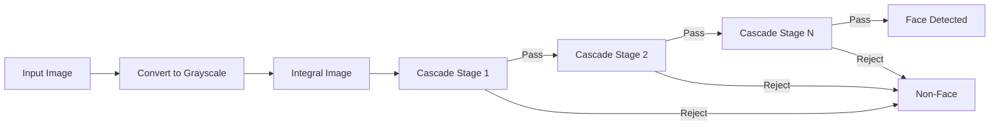
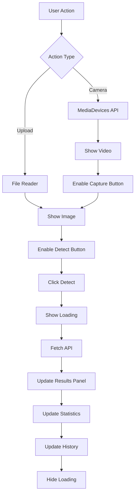

# 🔬 Technical Guide - Face Detection System

## 📚 Table of Contents
1. [Algorithm Overview](#algorithm-overview)
2. [Code Architecture](#code-architecture)
3. [Key Functions](#key-functions)
4. [Database Design](#database-design)
5. [Frontend Implementation](#frontend-implementation)
6. [Performance Optimization](#performance-optimization)
7. [Troubleshooting](#troubleshooting)

---

## 🧠 Algorithm Overview

### Viola-Jones Object Detection Framework

The system uses the **Viola-Jones algorithm**, a machine learning approach for real-time object detection.

#### Core Concepts

1. **Haar-like Features**
   - Rectangular features that capture intensity differences
   - Used to detect edges, lines, and patterns in faces

2. **Integral Image**
   - Allows rapid feature calculation
   - Computes sum of pixels in any rectangle in constant time

3. **AdaBoost Learning**
   - Selects most discriminative features
   - Combines weak classifiers into strong classifier

4. **Cascade Classifier**
   - Multi-stage decision process
   - Quickly rejects non-face regions
   - Focuses computation on promising areas

#### Detection Pipeline



---

## 🏛️ Code Architecture

### Backend Structure (`app.py`)

```python
# 1. INITIALIZATION (Lines 14-56)
Flask App Setup
├── Import dependencies
├── Configure max upload size (16MB)
├── Create directories (uploads, results, database)
├── Load Haar Cascade models
└── Initialize database

# 2. PREPROCESSING MODULE (Lines 62-80)
preprocessing(image, mode)
├── enhance: Histogram equalization
├── denoise: Non-local means denoising
├── sharpen: Kernel convolution
└── default: No processing

# 3. DETECTION ENGINE (Lines 86-176)
deteksi_wajah_advanced(gambar, detect_smile)
├── Convert to grayscale
├── Detect faces (scaleFactor=1.1, minNeighbors=5)
├── For each face:
│   ├── Draw face rectangle (green)
│   ├── Extract ROI (Region of Interest)
│   ├── Detect eyes (minNeighbors=10)
│   ├── Detect smile (minNeighbors=20, optional)
│   ├── Calculate confidence score
│   └── Annotate image
├── Draw summary overlay
└── Return results

# 4. DATABASE LAYER (Lines 42-54, 182-191)
init_db()
└── Create detections table

simpan_ke_db(face_count, eye_count, smile_count, process_time, image_path)
└── Insert detection record

# 5. API ROUTES (Lines 197-318)
/ (GET)          → Serve HTML
/detect (POST)   → Process detection
/history (GET)   → Fetch history
/stats (GET)     → Get statistics
```

---

## 🔑 Key Functions

### 1. `preprocessing(image, mode)`

**Purpose**: Enhance image quality before detection

**Implementation**:
```python
def preprocessing(image, mode='default'):
    if mode == 'enhance':
        # Histogram equalization for better contrast
        gray = cv2.cvtColor(image, cv2.COLOR_BGR2GRAY)
        enhanced = cv2.equalizeHist(gray)
        return cv2.cvtColor(enhanced, cv2.COLOR_GRAY2BGR)
    
    elif mode == 'denoise':
        # Non-local means denoising
        return cv2.fastNlMeansDenoisingColored(image, None, 10, 10, 7, 21)
    
    elif mode == 'sharpen':
        # Kernel-based sharpening
        kernel = np.array([[-1,-1,-1],
                          [-1, 9,-1],
                          [-1,-1,-1]])
        return cv2.filter2D(image, -1, kernel)
    
    return image
```

**Parameters**:
- `h=10`: Filter strength for luminance
- `hColor=10`: Filter strength for color
- `templateWindowSize=7`: Template patch size
- `searchWindowSize=21`: Search area size

---

### 2. `deteksi_wajah_advanced(gambar, detect_smile)`

**Purpose**: Main detection logic with multi-face support

**Key Parameters**:
```python
# Face Detection
face_cascade.detectMultiScale(
    abu_abu,
    scaleFactor=1.1,    # Image pyramid scale reduction
    minNeighbors=5,     # Min rectangles to retain detection
    minSize=(30, 30)    # Minimum face size in pixels
)

# Eye Detection
eye_cascade.detectMultiScale(
    roi_abu,
    scaleFactor=1.1,
    minNeighbors=10,    # Higher = fewer false positives
    minSize=(20, 20)
)

# Smile Detection
smile_cascade.detectMultiScale(
    roi_mulut_abu,
    scaleFactor=1.8,    # Larger scale for smile features
    minNeighbors=20,    # Very strict to avoid false positives
    minSize=(25, 25)
)
```

**Confidence Calculation**:
```python
confidence = min(jumlah_mata * 50, 100)
# 0 eyes = 0%
# 1 eye  = 50%
# 2 eyes = 100%
```

**Visualization**:
- Face: Green rectangle (0, 255, 0), thickness=3
- Eyes: Blue rectangle (255, 0, 0), thickness=2
- Eye center: Yellow circle (0, 255, 255)
- Smile: Yellow text "SMILE" (0, 255, 255)
- Summary: Black overlay with stats

---

### 3. `/detect` Route

**Purpose**: API endpoint for face detection

**Flow**:
```python
1. Receive JSON request
   ├── image (base64)
   ├── preprocess mode
   └── detect_smile flag

2. Decode base64 image
   ├── Split data URI
   ├── Base64 decode
   ├── Convert to PIL Image
   └── Convert to NumPy array

3. Apply preprocessing (if not default)

4. Run detection
   └── deteksi_wajah_advanced()

5. Save result
   ├── Generate timestamp filename
   ├── Save to results/ folder
   └── Save record to database

6. Encode result to base64

7. Return JSON response
   ├── success flag
   ├── result image (base64)
   ├── statistics
   └── face details array
```

**Error Handling**:
```python
try:
    # Detection logic
except Exception as e:
    return jsonify({
        'success': False,
        'message': str(e)
    }), 500
```

---

## 🗄️ Database Design

### Schema

```sql
CREATE TABLE detections (
    id INTEGER PRIMARY KEY AUTOINCREMENT,
    timestamp TEXT NOT NULL,
    face_count INTEGER NOT NULL,
    eye_count INTEGER NOT NULL,
    smile_count INTEGER NOT NULL,
    process_time INTEGER NOT NULL,
    image_path TEXT NOT NULL
);
```

### Indexes (Recommended for Production)
```sql
CREATE INDEX idx_timestamp ON detections(timestamp DESC);
CREATE INDEX idx_face_count ON detections(face_count);
```

### Query Examples

```python
# Insert detection
c.execute('''INSERT INTO detections 
             (timestamp, face_count, eye_count, smile_count, process_time, image_path)
             VALUES (?, ?, ?, ?, ?, ?)''',
          (timestamp, face_count, eye_count, smile_count, process_time, image_path))

# Get latest 50 records
c.execute('SELECT * FROM detections ORDER BY id DESC LIMIT 50')

# Get statistics
c.execute('SELECT COUNT(*), SUM(face_count), AVG(process_time) FROM detections')
```

---

## 🎨 Frontend Implementation

### State Management

```javascript
// Global state variables
let stream = null;           // Camera stream
let currentImage = null;     // Current image base64
let resultImageData = null;  // Result image base64
```

### Key Functions

#### 1. Camera Access
```javascript
async function openCamera() {
    stream = await navigator.mediaDevices.getUserMedia({ video: true });
    video.srcObject = stream;
    // Show video, hide image
}
```

#### 2. Image Capture
```javascript
function capture() {
    const canvas = document.createElement('canvas');
    canvas.width = video.videoWidth;
    canvas.height = video.videoHeight;
    canvas.getContext('2d').drawImage(video, 0, 0);
    currentImage = canvas.toDataURL('image/jpeg');
}
```

#### 3. Detection Request
```javascript
async function detectFace() {
    const response = await fetch('/detect', {
        method: 'POST',
        headers: { 'Content-Type': 'application/json' },
        body: JSON.stringify({
            image: currentImage,
            preprocess: preprocessMode,
            detect_smile: detectSmile
        })
    });
    const data = await response.json();
    // Update UI with results
}
```

### UI Update Flow



---

## ⚡ Performance Optimization

### 1. Image Optimization

```python
# Resize large images before processing
def resize_if_needed(image, max_dimension=1920):
    height, width = image.shape[:2]
    if max(height, width) > max_dimension:
        scale = max_dimension / max(height, width)
        new_width = int(width * scale)
        new_height = int(height * scale)
        return cv2.resize(image, (new_width, new_height))
    return image
```

### 2. Cascade Parameters Tuning

**For Speed**:
```python
scaleFactor=1.3,     # Larger steps (faster, less accurate)
minNeighbors=3,      # Fewer checks (faster, more false positives)
```

**For Accuracy**:
```python
scaleFactor=1.05,    # Smaller steps (slower, more accurate)
minNeighbors=8,      # More checks (slower, fewer false positives)
```

**Current Settings** (Balanced):
```python
scaleFactor=1.1,     # Good balance
minNeighbors=5,      # Moderate filtering
```

### 3. Database Optimization

```python
# Use connection pooling
from contextlib import contextmanager

@contextmanager
def get_db():
    conn = sqlite3.connect('database/faces.db')
    try:
        yield conn
    finally:
        conn.close()

# Usage
with get_db() as conn:
    c = conn.cursor()
    c.execute(...)
```

### 4. Caching Strategy

```python
# Cache cascade classifiers (already done globally)
face_cascade = cv2.CascadeClassifier(...)  # Loaded once at startup

# Cache preprocessed images (future enhancement)
from functools import lru_cache

@lru_cache(maxsize=10)
def get_preprocessed_image(image_hash, mode):
    # Return cached preprocessed image
    pass
```

---

## 🐛 Troubleshooting

### Common Issues

#### 1. No Faces Detected

**Causes**:
- Poor lighting
- Face not frontal
- Face too small
- Image quality issues

**Solutions**:
```python
# Try different preprocessing
modes = ['enhance', 'denoise', 'sharpen']

# Adjust detection parameters
scaleFactor=1.05,    # More sensitive
minNeighbors=3,      # Less strict
minSize=(20, 20)     # Smaller minimum size
```

#### 2. False Positives

**Causes**:
- Low minNeighbors value
- Complex background
- Similar patterns to faces

**Solutions**:
```python
# Increase strictness
minNeighbors=8,      # More strict
minSize=(50, 50)     # Larger minimum size
```

#### 3. Slow Processing

**Causes**:
- Large image size
- Multiple preprocessing steps
- Many faces in image

**Solutions**:
```python
# Resize image first
image = resize_if_needed(image, max_dimension=1280)

# Disable smile detection
detect_smile=False

# Use default preprocessing
preprocess='default'
```

#### 4. Camera Not Working

**Causes**:
- Browser permissions denied
- HTTPS required (in production)
- Camera in use by another app

**Solutions**:
```javascript
// Check browser support
if (!navigator.mediaDevices) {
    alert('Camera not supported in this browser');
}

// Handle errors
try {
    stream = await navigator.mediaDevices.getUserMedia({ video: true });
} catch (err) {
    if (err.name === 'NotAllowedError') {
        alert('Camera permission denied');
    } else if (err.name === 'NotFoundError') {
        alert('No camera found');
    }
}
```

### Debug Mode

```python
# Enable detailed logging
import logging
logging.basicConfig(level=logging.DEBUG)

# Add debug prints
print(f"Image shape: {image.shape}")
print(f"Faces detected: {len(faces)}")
print(f"Processing time: {time_ms}ms")
```

---

## 🔧 Configuration Guide

### Development vs Production

**Development** (`app.py:335`):
```python
app.run(debug=True, host='0.0.0.0', port=5000)
```

**Production**:
```python
# Use production WSGI server
# gunicorn app:app -w 4 -b 0.0.0.0:5000

app.run(debug=False, host='0.0.0.0', port=5000)
```

### Environment Variables

```bash
# .env file (future enhancement)
FLASK_ENV=production
MAX_UPLOAD_SIZE=16777216  # 16MB in bytes
DATABASE_PATH=database/faces.db
RESULTS_PATH=results/
UPLOADS_PATH=uploads/
```

---

## 📊 Monitoring & Logging

### Add Request Logging

```python
from datetime import datetime

@app.before_request
def log_request():
    print(f"[{datetime.now()}] {request.method} {request.path}")

@app.after_request
def log_response(response):
    print(f"[{datetime.now()}] Response: {response.status_code}")
    return response
```

### Performance Metrics

```python
import time

def track_performance(func):
    def wrapper(*args, **kwargs):
        start = time.time()
        result = func(*args, **kwargs)
        duration = (time.time() - start) * 1000
        print(f"{func.__name__} took {duration:.2f}ms")
        return result
    return wrapper

@track_performance
def deteksi_wajah_advanced(gambar, detect_smile):
    # ... detection logic
```

---

## 🚀 Deployment Checklist

- [ ] Set `debug=False` in production
- [ ] Use production WSGI server (gunicorn/uwsgi)
- [ ] Enable HTTPS for camera access
- [ ] Set up proper error logging
- [ ] Configure CORS if needed
- [ ] Optimize database (indexes, vacuum)
- [ ] Set up monitoring (uptime, errors)
- [ ] Configure firewall rules
- [ ] Set up backup for database
- [ ] Document API for users

---

**Last Updated**: December 4, 2025  
**Version**: 1.0.0
